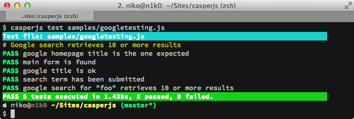

========
CasperJS
========

CasperJS is an open source navigation scripting & testing utility written in Javascript and based on PhantomJS_ — the scriptable headless WebKit_ engine.

It eases the process of **defining a full navigation scenario** and provides useful **high-level functions, methods & syntactic sugar** for doing common tasks such as:

- defining & ordering browsing :ref:`navigation steps <quickstart>`
- :ref:`filling & submitting forms <casper_fill>`
- :ref:`clicking <casper_click>` & following links
- :ref:`capturing screenshots <casper_captureselector>` of a page (or part of it)
- :ref:`testing <tester_module>` remote DOM
- :doc:`logging <logging>` events
- :ref:`downloading <casper_download>` resources, including binary ones
- writing :doc:`functional test suites <testing>`, saving results as JUnit XML
- `scraping <https://github.com/n1k0/casperjs/blob/master/samples/>`_ Web contents

Index
=====

.. toctree::
    :maxdepth: 2

    installation
    quickstart
    events-filters
    faq
    selectors
    logging
    testing
    extending
    debugging
    license
    rst-syntax

API documentation
=================

These are guides and API documentation for the individual CasperJS core modules and extensions.

See the :ref:`genindex` if you are looking for the docs for a particular part of the API.

.. toctree::
    :maxdepth: 2

    modules/index
    modules/casper
    modules/cli
    modules/clientutils
    modules/tester
    modules/utils

.. _PhantomJS: http://phantomjs.org/
.. _WebKit: http://www.webkit.org/
